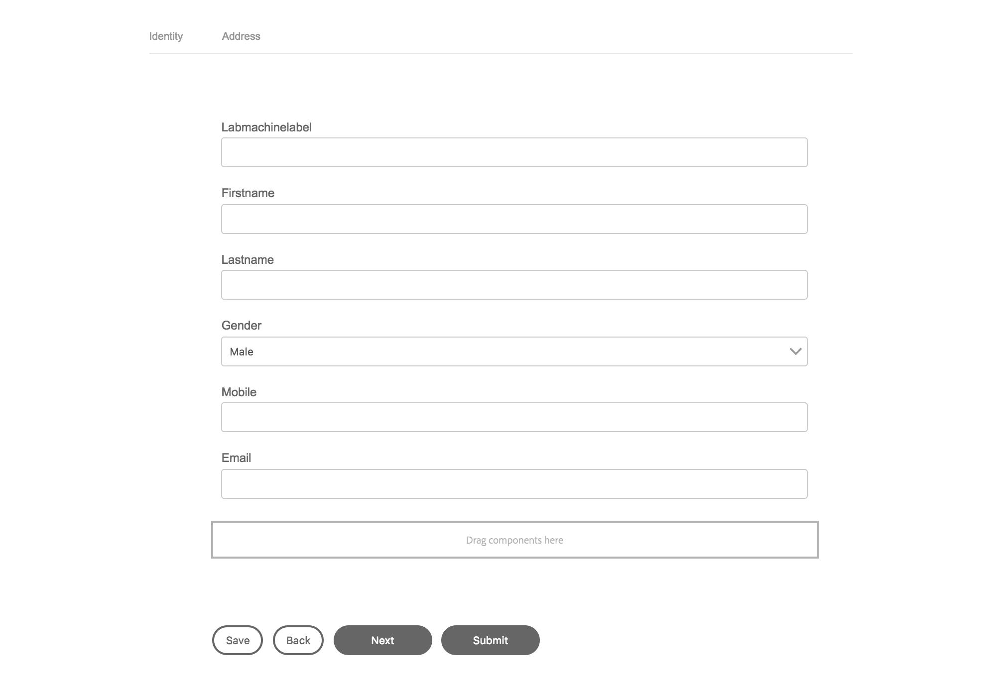

# Excerice 2 - Create a (JSON Schema based) Form (10')

AEM Forms supports creation of an adaptive form by using an existing JSON Schema as the form model. This JSON Schema represents the structure in which data is produced or consumed by the back-end system in your organization. The JSON Schema you use should be compliant with v4 specifications.  

The key features of using an JSON Schema are:

The structure of the JSON is displayed as a tree in the Content Finder tab in the authoring mode for an adaptive form. You can drag and add element from the JSON hierarchy to the adaptive form.
You can pre-populate the form using JSON that is compliant with the associated schema.
On submission, the data entered by the user is submitted as JSON that aligns with the associated schema.
An JSON Schema consists of simple and complex element types. The elements have attributes that add rules to the element. When these elements and attributes are dragged onto an adaptive form, they are automatically mapped to the corresponding adaptive form component.

https://helpx.adobe.com/experience-manager/6-3/forms/using/adaptive-form-json-schema-form-model.html

## Step 1 - Explore JSON Schema

Expolore the the JSON schema that we will use to define the data model of our form.

```javascript
{
    "$schema": "http://json-schema.org/draft-04/schema#",
    "definitions": {
        "profile": {
            "type": "object",
            "properties": {
                "identity": {
                    "$ref": "#/definitions/identity"
                },
                "address": {
                    "$ref": "#/definitions/address"
                }
                
            }
        },
        "identity": {
            "type": "object",
            "properties": {
                "labmachinelabel": {
                    "type": "string"
                   ,"pattern" : "^(CS)[0-9]{2}-[0-9]{3}$"    
                },
                "firstname": {
                    "type": "string"
                },
                "lastname": {
                    "type": "string"
                },
                "gender": {
                    "type": "string"
                    ,"enum" : ["Male", "Female"]
                },
                "mobile": {
                    "type": "string"
                },
                "email": {
                    "type": "string"
                }
            }
        },
        "address": {
            "type": "object",
            "properties": {
                "street": {
                    "type": "string"
                },
                "postalcode": {
                    "type": "string"
                }
            }
        }
    },
    "type": "object",
    "properties": {
        "profile": {
            "$ref": "#/definitions/profile"
        }
    }
}
```


## Step 2 - Create a form and assign the schema

* In AEM, navigate to forms (http://localhost:4502/aem/forms.html/content/dam/formsanddocuments) and create a folder Summit2018
* Open de Summit2018 folder
* Create an Adaptive Form
* Select the "Blank" template
* Name the form "TL15"
* Select "Form model"
* Select From : Schema
* Upload from disk 
* Click "Upload Schema Definition"
* Select "summit-tl15.schema.json" in the TL15-Master/resources folder on your Desktop
* You should see "Valid Schema Selected"
* Create and Open form

## Step 3 - Add the form fields

See [How to activate the configuration panel for a form component](../generic/README.md)

### Define you form layout

* Toggle the side panel
* Select "Root Panel" from the available Form Objects
* Click "Configure"
* Select "Tabs on Top" for panel layout property
* Confirm

### Add the "Identity" panel
* Select the "Root panel" component on the right and click "..."
* Add Child panel "Identity" (title and name)

### Add the "Address" panel

* Select the "Root panel" component on the right and click "..."
* Add Child panel "Address" (title and name)

### Add the toolbar

* Select the "Root panel" component on the right and click "..."
* Add Toolbar
* Select the "Toolbar for Panel: : Root Panel" component
* Use the "+" to add a next, previous, save and submit button

### Add data model fields to the "Identity" panel

* Select the top tab "Identity"
* Click the "Content" icon on the left
* Select "Data Model Objects"
* Drag and drop all the "Identity" fields from the model onto the "Identity" component

Your form should look like:



### Add data model fields to the "Address" panel

* Select the top tab "Address"
* Drag and drop all the "Address" fields from the model onto the "Address" component
